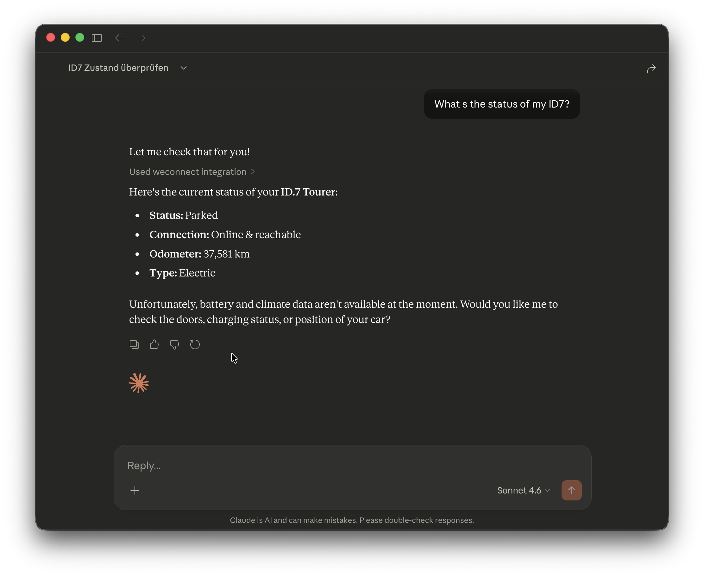
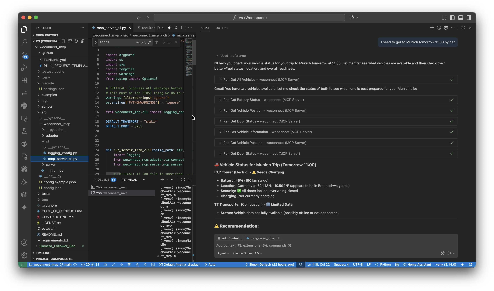
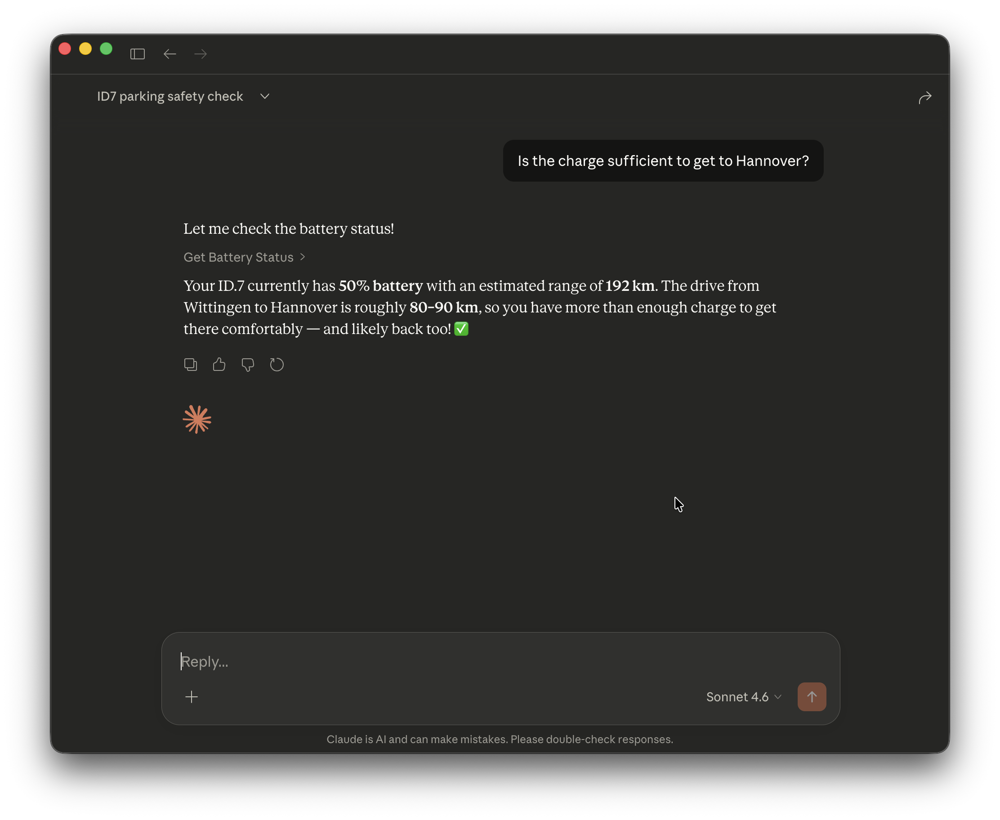
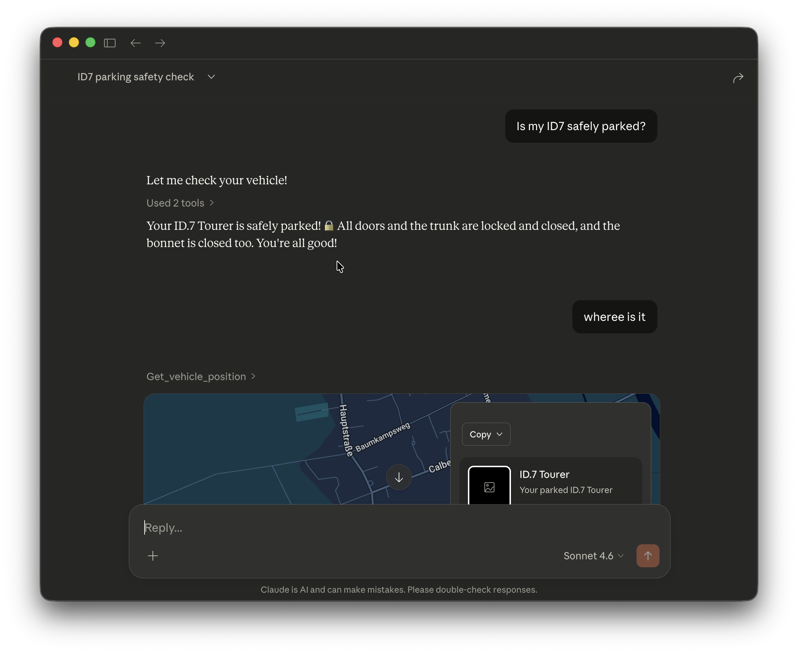

# weconnect_mvp

[](https://www.python.org/downloads/)
[](tests/)
[](https://github.com/psf/black)
[](http://creativecommons.org/licenses/by-sa/4.0/)

**MCP Server for Volkswagen Vehicles**  
A developer-focused server that exposes information from VW vehicles via a Model Context Protocol (MCP) interface. This project is designed for integration, automation, and experimentation with connected car data.

---

## See It In Action

<p align="center">
  
  
</p>

*Control your VW vehicle through AI assistants like Claude Desktop and GitHub Copilot*

---

## Quick Start

Get up and running in 3 steps:

1. **Install**
   ```bash
   git clone https://github.com/Smengerl/weconnect_mvp.git
   cd weconnect_mvp
   ./scripts/setup.sh
   ```

2. **Configure**  
   Edit `src/config.json` with your VW credentials (username, password, spin)

3. **Use with AI Assistant**
   
   **Option A: Claude Desktop**
   ```bash
   ./scripts/create_claude_config.sh  # Copy output to Claude config
   ```
   Restart Claude Desktop and ask: *"What vehicles are available?"*
   
   **Option B: GitHub Copilot (VS Code)**

   ```bash
   ./scripts/create_github_copilot_config.sh  # Follow instructions to add to VS Code mcp.json
   ```   
   Restart VS Code and ask in Copilot Chat: *"What vehicles are available?"*

For detailed instructions, see sections below.

---

## Features

- **MCP Server**: Provides a standard MCP interface for accessing vehicle data
- **Volkswagen Integration**: Connects to VW vehicles using the `carconnectivity` library
- **AI Assistant Ready**: Works with Claude Desktop, VS Code Copilot, and other MCP-compatible tools
- **Flexible CLI**: Multiple transport modes (stdio and HTTP)
- **Configurable**: Easily adapt connection and authentication settings via config file


## Getting Started

### Prerequisites

- Python 3.8+
- VW account credentials (username, password, and optionally a spin)
- (Recommended) Virtual environment

### Installation

**Quick Start (Recommended):**

Simply run the setup script which handles everything automatically:

```bash
git clone https://github.com/Smengerl/weconnect_mvp.git
cd weconnect_mvp
./scripts/setup.sh
```

The script will:
- ✅ Detect your Python installation
- ✅ Create a virtual environment at `.venv/`
- ✅ Install all dependencies
- ✅ Create configuration template

**Manual Installation (Alternative):**

```bash
git clone https://github.com/Smengerl/weconnect_mvp.git
cd weconnect_mvp
python -m venv .venv
source .venv/bin/activate  # On Windows: .venv\Scripts\activate
pip install -r requirements.txt
```

#### Windows-Specific Notes

⚠️ **Important for Windows Users:**

The setup script automatically detects and avoids Microsoft Store Python (which doesn't work). If you see errors about Python not found:

1. **Install Python from python.org** (not Microsoft Store)
   - Download from [python.org](https://www.python.org)
   - ✅ Check "Add Python to PATH" during installation

2. **Disable Microsoft Store Python alias** (if you have it):
   - Settings → Apps → Advanced app settings → App execution aliases
   - Turn OFF: `python.exe`, `python3.exe`, `python3.x.exe`

3. **Verify your Python installation:**
   ```bash
   # Should return a path like: C:\Program Files\PythonXXX\python.exe
   where python
   ```

4. **Run diagnostic tool:**
   ```powershell
   & .\scripts\diagnose_python.ps1
   ```


### Configuration

The server requires a configuration file (default: `src/config.json`).  
**You must create this file based on the provided example and add your VW credentials.**

**Step 1: Copy the example configuration**
```bash
cp src/config.example.json src/config.json
```

**Step 2: Edit the configuration with your VW credentials**
```bash
# Use your preferred editor
nano src/config.json
# or
code src/config.json
```


**Configuration Parameters:**
- `username`: Your VW WeConnect account email
- `password`: Your VW WeConnect account password
- `spin`: Your VW S-PIN (4 digits, required for some vehicle commands)
- `interval`: Data refresh interval in seconds (default: 300 = 5 minutes)
- `max_age`: Maximum age of cached data in seconds

**Security Notice:**  
⚠️ **NEVER commit `src/config.json` to version control!**  
This file is automatically excluded via `.gitignore` to protect your credentials.

---

## Usage

The server supports two transport modes depending on the AI agent you want to use:
- **stdio**: When running MCP server locally on the same machine as your AI agent (Claude Desktop, VS Code Copilot)
- **http**: For cloud deployment or when the local AI agent requires this mode (e.g. ChatGPT)

### CLI Options

You can start the MCP server using the provided CLI scripts or directly via Python:

#### 1. Starting the server in foreground (with logs to console)
```bash
./scripts/start_server_fg.sh
```

#### 2. Starting the server in background (with logs to file)
```bash
./scripts/start_server_bg.sh
```

If started in the background, stop the server using the script:
```bash
./scripts/stop_server.sh
```

Alternatively, kill the process via PID.

#### 3. Starting the server directly via Python
```bash
python -m weconnect_mcp.cli.mcp_server_cli path/to/config.json --port 8765
```


### CLI Parameters

The MCP server can be started with several command-line parameters to control its behavior:

| Parameter           | Default                                   | Description                                                      |
|---------------------|-------------------------------------------|------------------------------------------------------------------|
| `config`            | (required)                                | Path to the configuration file                                   |
| `--tokenstorefile`  | `/tmp/tokenstore`                         | Path for the token store file                                    |
| `--log-level`       | `INFO`                                    | Set logging level: `DEBUG`, `INFO`, `WARNING`, `ERROR`, `CRITICAL` |
| `--log-file`        | (stderr only)                             | Path to log file (if not set, logs to stderr only)              |
| `--transport`       | `stdio`                                   | Transport mode: `stdio` (for AI) or `http` (for API)            |
| `--port`            | `8667`                                    | Port for HTTP mode                                               |

**Example:**

```bash
python -m weconnect_mcp.cli.mcp_server_cli src/config.json --log-level DEBUG --log-file server.log --transport http --port 8765
```

---

## AI Integration

This MCP server provides **5 tools** that AI assistants can use to interact with your VW vehicle:

| Tool | Description |
|------|-------------|
| `list_vehicles` | Get all available vehicle IDs |
| `get_vehicle_state` | Get complete vehicle state (battery, position, doors, windows, climate, tyres) |
| `get_vehicle_doors` | Get door lock and open/closed status |
| `get_vehicle_windows` | Get window open/closed status |
| `get_vehicle_tyres` | Get tyre pressure and temperature |

### What AI Assistants Can Do

✅ List vehicles and recognize their IDs  
✅ Intelligently interpret vehicle status  
✅ Retrieve specific information (doors, windows, tyres)  
✅ Answer natural questions like "Where is my car?"  
✅ Combine multiple queries for complex answers  

---

### Claude Desktop Integration

Generate your configuration for Claude Desktop with the following script and follow the instructions to add it to your Claude Desktop configuration:

```bash
cd /path/to/weconnect_mvp
./scripts/create_claude_config.sh
```

Reload Claude Desktop and ask questions like:
- "What vehicles are available?"
- "Show me my car's battery status"
- "Are my doors locked?"

#### Example Usage

**Check battery status and state of charge:**



**Get complete vehicle status:**


**Check vehicle position:**



**Start charging session:**


**Interactive demo video:**


---

### GitHub Copilot (VS Code) Integration

Generate your configuration for GitHub Copilot with the following script and follow the instructions to add it to your VS Code settings:

```bash
cd /path/to/weconnect_mvp
./scripts/create_github_copilot_config.sh
```

Restart VS Code and verify installation by typing `/list` in Copilot Chat. Look for tools starting with `mcp_weconnect_`

#### Example Usage

**Prepare for a trip - check battery, charging status, doors, and location:**


**Interactive demo video:**


---

### Microsoft Copilot Desktop Integration (untested)

Generate your configuration for Microsoft Copilot Desktop with the following script:

```bash
cd /path/to/weconnect_mvp
./scripts/create_copilot_desktop_config.sh
```

Copy the configuration file to Microsoft Copilot Desktop's config directory:

```bash
mkdir -p ~/Library/Application\ Support/Microsoft/Copilot
cp tmp/copilot_desktop_mcp.json ~/Library/Application\ Support/Microsoft/Copilot/mcp.json
```

Restart Microsoft Copilot Desktop completely and test

---

### Other AI Tools (Cline)

The server uses the standard MCP protocol and works with all MCP-compatible tools.

**Cline (VS Code Extension)** - Configuration in `.vscode/cline_mcp_settings.json`:

```json
{
  "mcpServers": {
    "weconnect": {
      "command": "python",
      "args": [
        "-m",
        "weconnect_mcp.cli.mcp_server_cli",
        "/path/to/your/config.json"
      ],
      "env": {
        "PYTHONPATH": "/path/to/weconnect_mvp/src"
      }
    }
  }
}
```

---

### HTTP Mode for API Access

You can also start the server in HTTP mode for programmatic access:

```bash
python -m weconnect_mcp.cli.mcp_server_cli \
    /path/to/config.json \
    --transport http \
    --port 8765
```

The server will then be available at `http://localhost:8765`.

- **[scripts/README.md](scripts/README.md)** - All available scripts and how to use them
- **[scripts/lib/README.md](scripts/lib/README.md)** - Python detection library documentation
- **[tests/README.md](tests/README.md)** - Test suite overview
- **[CONTRIBUTING.md](CONTRIBUTING.md)** - Contribution guidelines

---

## Testing

Run the test suite with:

```bash
# Run all tests (including slow real API tests)
./scripts/test.sh

# Run only fast mock tests (skip real API tests - recommended for CI/CD)
./scripts/test.sh --skip-slow

# Run with verbose output
./scripts/test.sh --skip-slow -v

# Show help
./scripts/test.sh --help
```

**Test Structure:**
- **197 fast mock tests** - Run in ~4 seconds, no VW credentials needed
- **18 slow real API tests** - Require valid VW account in `src/config.json`

For detailed test documentation, see [tests/README.md](tests/README.md)

---

## Development Notes

- For development, always use a virtual environment and install in editable mode
- The CLI scripts activate the virtual environment automatically
- Main package source is under `src/`

### Publication Readiness Agent

The project includes a custom GitHub Copilot agent to ensure publication readiness. This agent verifies:

- ✅ Code documentation quality (docstrings, type hints)
- ✅ README.md completeness
- ✅ License file presence
- ✅ Unit test coverage
- ✅ CLI scripts documentation

**Usage:**
```bash
# Via GitHub Copilot
@workspace /agent publication-readiness Run publication check

# Or follow the manual checklist
cat .github/agents/publication-readiness.md
```

For more information, see [.github/agents/README.md](.github/agents/README.md).

### Security Best Practices

⚠️ **Never** commit `config.json` with your VW credentials!  
⚠️ Add `src/config.json` to `.gitignore` if not already done  
⚠️ The token store (default: `/tmp/tokenstore`) contains session tokens - keep it secure  
⚠️ Use environment variables for sensitive data in production  
⚠️ HTTP mode should only be used in trusted networks  
⚠️ Consider additional authentication for production deployments

---

#### Known Limitations

1. **No license plate data (VW API limitation):** As of February 2026, the VW WeConnect API does not provide license plate information. All vehicles will show `license_plate: null`. This is a limitation of Volkswagen's official API, not this server.
2. **First start takes time:** VW API login can take 10-30 seconds
3. **VW API rate limiting:** Too many requests may be blocked
4. **Token expiration:** After a few hours, re-authentication is required

---

## Contributing

Contributions are welcome! Please see `CONTRIBUTING.md` and follow the code of conduct.

---

## License

This project is licensed under the Creative Commons Attribution-ShareAlike 4.0 International License (CC BY-SA 4.0) — see `LICENSE.txt` for details or visit http://creativecommons.org/licenses/by-sa/4.0/

---

## Credits

This project is built on top of the excellent **[CarConnectivity](https://github.com/tillsteinbach/CarConnectivity)** library by [Till Steinbach](https://github.com/tillsteinbach). CarConnectivity provides the core functionality for connecting to Volkswagen's WeConnect API and handling vehicle data retrieval.

---

## Additional Resources

- [MCP Specification](https://spec.modelcontextprotocol.io/)
- [FastMCP Documentation](https://github.com/jlowin/fastmcp)