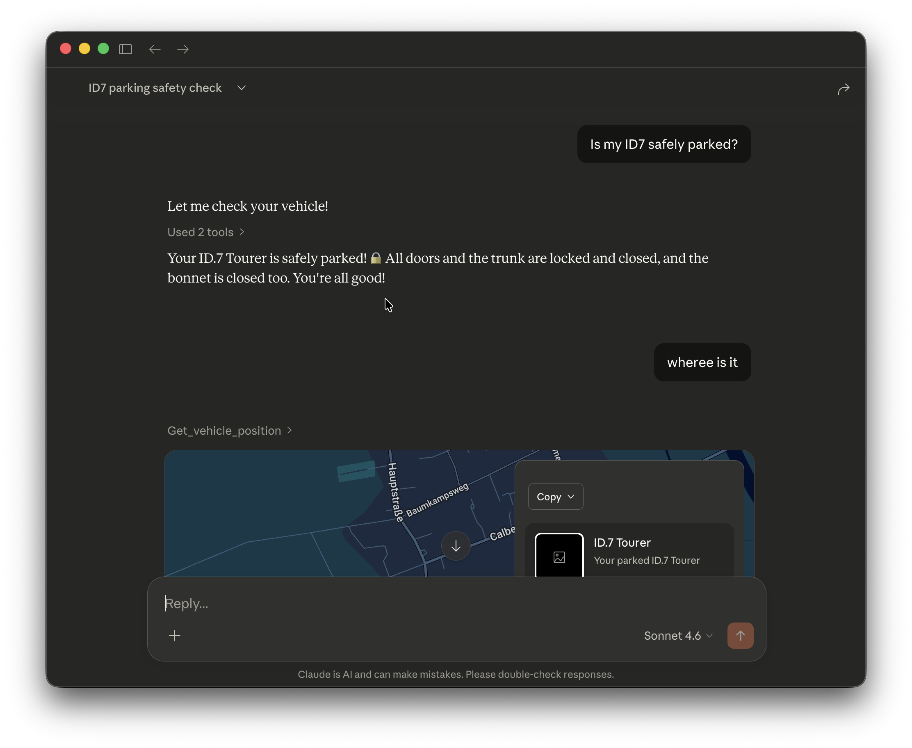
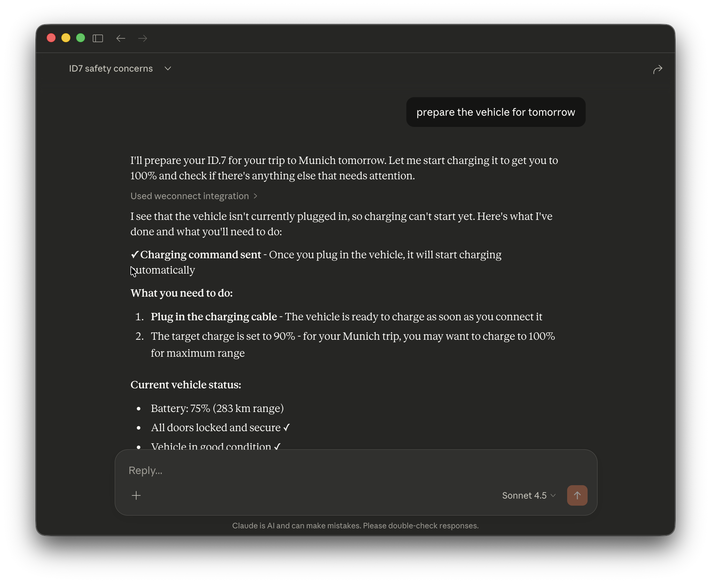

# weconnect_mvp

[](https://www.python.org/downloads/)
[](tests/)
[](https://github.com/psf/black)
[](http://creativecommons.org/licenses/by-sa/4.0/)

> [!WARNING]
> **VW API Access Currently Blocked for Third-Party and Open-Source Projects**
>
> As of May 2026, Volkswagen has shut down the brand-app interface previously used by this project
> and other third-party tools (Home Assistant, EVCC, openWB, …). Third-party clients — including
> this MCP server — are **no longer able to connect** to VW's backend.
>
> The new interface requires cryptographic device attestation ("client assertion") proving that API
> requests originate from an official VW app on an unmodified device. Open-source projects cannot
> obtain this credential without a formal, paid partnership with VW Group Info Services. As of
> June 2026, **no simple alternative is known** for open-source projects. VW has stated they are
> in dialogue with the open-source community, but no concrete solution has been announced.
>
> [Transition to next-generation vehicle data interfaces](https://drivesomethinggreater.com/newsroom/short-news/2026-4-02-Transition) (April 2, 2026)
>
> **Workaround available**: this server now supports a second, read-only backend via the
> [Tibber Data API](https://data-api.tibber.com/docs/) (Tibber is an official VW integration
> partner and can still reach VW vehicle data). It's the **default backend** for exactly this
> reason. See [Choosing a Backend](#choosing-a-backend) below — and
> [`experiment/tibber-integration/TIBBER_API.md`](experiment/tibber-integration/TIBBER_API.md)
> for the full research behind it.

**MCP Server for Volkswagen Vehicles**  
A developer-focused server that exposes information from VW vehicles via a Model Context Protocol (MCP) interface. This project is designed for integration, automation, and experimentation with connected car data.

---

## See It In Action

<p align="center">
  
  
</p>

*Control your VW vehicle through AI assistants like Claude Desktop and GitHub Copilot*

---

## Quick Start

Get up and running in 3 steps:

1. **Install**

   ```bash
   git clone https://github.com/Smengerl/weconnect_mvp.git
   cd weconnect_mvp
   ./scripts/setup.sh
   ```

2. **Configure**  
   Default backend is **Tibber** (read-only, works today) — register an OAuth2 client, then:
   ```bash
   cp src/tibber_config.example.json src/tibber_config.json
   # edit src/tibber_config.json with your client_id/client_secret
   python -m weconnect_mcp.cli.tibber_login_cli   # one-time interactive login
   ```
   See [Choosing a Backend](#choosing-a-backend) for where to get the client id/secret.  
   (Or, if VW access is available to you: edit `src/config.json` with your VW credentials and
   pass `--backend carconnectivity` everywhere below.)

3. **Use with AI Assistant**

   **Option A: Claude Desktop**

   ```bash
   ./scripts/create_claude_config.sh  # Copy output to Claude config
   ```

   Restart Claude Desktop and ask: *"What vehicles are available?"*

   **Option B: GitHub Copilot (VS Code)**

   ```bash
   ./scripts/create_github_copilot_config.sh  # Follow instructions to add to VS Code mcp.json
   ```

   Restart VS Code and ask in Copilot Chat: *"What vehicles are available?"*

   > Both scripts point the generated config at `src/tibber_config.json` — no secrets need to go
   > into the Claude Desktop / VS Code config itself, since Claude Desktop and VS Code launch the
   > server with their own environment (not your shell's `export`s), which is exactly why a file
   > is used here instead of environment variables. Verified live with a completely empty
   > environment (`env -i`), matching how those apps actually launch the server.

   **Option C: Cloud deployment (ChatGPT, Claude.ai, …)**  
   Deploy to Railway (or any Docker host) – see [Cloud Deployment](#cloud-deployment) below.

For detailed instructions, see sections below.

---

## Features

- **MCP Server**: Provides a standard MCP interface for accessing vehicle data
- **Two selectable backends** (`--backend` flag, see [Choosing a Backend](#choosing-a-backend)):
  - **Tibber** (default) — read-only, via the Tibber Data API; works today
  - **CarConnectivity** — VW-direct via the `carconnectivity` library; currently blocked by VW
- **AI Assistant Ready**: Works with Claude Desktop, VS Code Copilot, ChatGPT, Claude.ai and other MCP-compatible tools
- **Cloud Deployable**: Ships with `Dockerfile`, `docker-compose.yml` and Railway config for one-command cloud deployment
- **API-Key Authentication**: Bearer token auth for secure public HTTP endpoints
- **Flexible CLI**: Multiple transport modes (stdio for local, HTTP for cloud)
- **Configurable**: Credentials via config file or environment variables (for Docker / Railway)

## Choosing a Backend

The server supports two vehicle-data backends, selected with `--backend {tibber,carconnectivity}`:

| | **`tibber`** (default) | **`carconnectivity`** |
|---|---|---|
| Status | ✅ Works today | ❌ Blocked by VW (see warning above) |
| Data source | [Tibber Data API](https://data-api.tibber.com/docs/) (Tibber is an official VW integration partner) | VW WeConnect directly, via the `carconnectivity` library |
| Access | **Read-only** — no lock/unlock, climate, charging, or light control | Full read + control |
| Data available | Identity (VIN, brand, model, name, online state) + charging/range (SoC, target SoC, range, plug status, charging state) — electric vehicles only | Everything: doors, windows, tyres, lights, climate, GPS position, maintenance, plus full control |
| Setup | OAuth2 client + one-time interactive login (below) | `src/config.json` with VW username/password/spin |
| Background | [`experiment/tibber-integration/TIBBER_API.md`](experiment/tibber-integration/TIBBER_API.md) | this README |

**Why Tibber is the default**: it's the only backend that currently works. It trades away vehicle
control and most read data (doors, climate, position, maintenance — see the full 51-point
comparison in [`experiment/tibber-integration/README.md`](experiment/tibber-integration/README.md))
for read-only charging/range status that keeps working despite VW's block. If VW restores
third-party access, switch back with `--backend carconnectivity`.

### Setting Up the Tibber Backend (default)

1. **Register an OAuth2 client** at <https://data-api.tibber.com/clients/manage/> — see
   [`experiment/tibber-integration/README.md`](experiment/tibber-integration/README.md) for the
   exact scopes to select and redirect URI to use.
2. **Provide credentials** — two options, and you can mix them (environment variables override
   the file when both are present):

   **Option A — file** (recommended for Claude Desktop / VS Code Copilot: those launch the server
   with their own environment, not your shell's, so `export`ed variables never reach it):
   ```bash
   cp src/tibber_config.example.json src/tibber_config.json
   # edit src/tibber_config.json with your client_id/client_secret
   ```
   `src/tibber_config.json` is gitignored, same as `src/config.json` for the VW backend.

   **Option B — environment variables** (recommended for Docker/Railway):
   ```bash
   export TIBBER_CLIENT_ID="your-client-id"
   export TIBBER_CLIENT_SECRET="your-client-secret"
   export TIBBER_REDIRECT_URI="http://localhost:8515/callback"   # optional, this is the default
   export TIBBER_TOKEN_PATH="./tibber_tokens.json"                # optional, this is the default
   ```
3. **Run the one-time interactive login** (opens a browser; only needs to be done once — the
   server itself never opens a browser, it only refreshes the resulting token non-interactively):
   ```bash
   python -m weconnect_mcp.cli.tibber_login_cli
   ```
4. **Start the server** — `tibber` is the default backend, and the config file is optional
   (pass it if you used Option A above):
   ```bash
   python -m weconnect_mcp.cli.mcp_server_cli [src/tibber_config.json]
   ```

`./scripts/create_claude_config.sh` and `./scripts/create_github_copilot_config.sh` (see
[Quick Start](#quick-start)) already generate configs pointing at `src/tibber_config.json` — no
manual editing of the generated MCP client config needed.

### Setting Up the CarConnectivity Backend (VW-direct, currently blocked)

Requires `src/config.json` with VW credentials — see [Configuration](#configuration) below — and
`--backend carconnectivity` on every invocation. Currently fails to connect (`AuthenticationError`)
because VW blocks third-party access; kept for when/if that changes.

## Getting Started

### Prerequisites

- Python 3.8+
- For the **Tibber** backend (default): a Tibber account with a VW vehicle paired to it, and an
  OAuth2 client registered at data-api.tibber.com (see [Choosing a Backend](#choosing-a-backend))
- For the **CarConnectivity** backend: VW account credentials (username, password, and optionally
  a spin) — currently non-functional, see warning above
- (Recommended) Virtual environment

### Installation

**Quick Start (Recommended):**

Simply run the setup script which handles everything automatically:

```bash
git clone https://github.com/Smengerl/weconnect_mvp.git
cd weconnect_mvp
./scripts/setup.sh
```

The script will:

- ✅ Detect your Python installation
- ✅ Create a virtual environment at `.venv/`
- ✅ Install the project in editable mode (`pip install -e .`)
- ✅ Create configuration template

**Manual Installation (Alternative):**

```bash
git clone https://github.com/Smengerl/weconnect_mvp.git
cd weconnect_mvp
python -m venv .venv
source .venv/bin/activate  # On Windows: .venv\Scripts\activate
pip install -e .
```

For running tests locally, install test extras:

```bash
pip install -e ".[test]"
```

#### Windows-Specific Notes

⚠️ **Important for Windows Users:**

The setup script automatically detects and avoids Microsoft Store Python (which doesn't work). If you see errors about Python not found:

1. **Install Python from python.org** (not Microsoft Store)
   - Download from [python.org](https://www.python.org)
   - ✅ Check "Add Python to PATH" during installation

2. **Disable Microsoft Store Python alias** (if you have it):
   - Settings → Apps → Advanced app settings → App execution aliases
   - Turn OFF: `python.exe`, `python3.exe`, `python3.x.exe`

3. **Verify your Python installation:**

   ```bash
   # Should return a path like: C:\Program Files\PythonXXX\python.exe
   where python
   ```

4. **Run diagnostic tool:**

   ```powershell
   & .\scripts\diagnose_python.ps1
   ```

### Configuration

**This section applies to the `carconnectivity` backend only.** The default `tibber` backend
needs no config file — see [Setting Up the Tibber Backend](#setting-up-the-tibber-backend-default)
above instead.

The `carconnectivity` backend requires a configuration file (default: `src/config.json`).  
**You must create this file based on the provided example and add your VW credentials.**

**Step 1: Copy the example configuration**

```bash
cp src/config.example.json src/config.json
```

**Step 2: Edit the configuration with your VW credentials**

```bash
# Use your preferred editor
nano src/config.json
# or
code src/config.json
```

**Configuration Parameters:**

- `username`: Your VW WeConnect account email
- `password`: Your VW WeConnect account password
- `spin`: Your VW S-PIN (4 digits, required for some vehicle commands)
- `interval`: Data refresh interval in seconds (default: 300 = 5 minutes)
- `max_age`: Maximum age of cached data in seconds

**Security Notice:**  
⚠️ **NEVER commit `src/config.json` to version control!**  
This file is automatically excluded via `.gitignore` to protect your credentials.

---

## Usage

The server supports two transport modes depending on the AI agent you want to use:

- **stdio**: When running MCP server locally on the same machine as your AI agent (Claude Desktop, VS Code Copilot)
- **http**: For cloud deployment or when the local AI agent requires this mode (e.g. ChatGPT)

### CLI Options

You can start the MCP server using the provided CLI scripts or directly via Python:

#### 1. Starting the server in foreground (with logs to console)

```bash
./scripts/start_server_fg.sh
```

#### 2. Starting the server in background (with logs to file)

```bash
./scripts/start_server_bg.sh
```

If started in the background, stop the server using the script:

```bash
./scripts/stop_server.sh
```

Alternatively, kill the process via PID.

#### 3. Starting the server directly via Python

```bash
# Default backend (tibber) -- no config file needed:
python -m weconnect_mcp.cli.mcp_server_cli --port 8089

# Explicit VW-direct backend (currently blocked by VW, see warning above):
python -m weconnect_mcp.cli.mcp_server_cli path/to/config.json --backend carconnectivity --port 8089
```

> `./scripts/start_server_fg.sh` forwards extra arguments, so
> `./scripts/start_server_fg.sh "" 8765 --backend carconnectivity` works too.
> `./scripts/start_server_bg.sh` does **not** currently forward extra arguments — use the direct
> Python invocation above if you need `--backend carconnectivity` in the background.

### CLI Parameters

The MCP server can be started with several command-line parameters to control its behavior:

| Parameter           | Default                                   | Description                                                      |
|---------------------|-------------------------------------------|------------------------------------------------------------------|
| `config`            | (none)                                    | Path to the configuration file. Required for `--backend carconnectivity`; unused (and optional) for `--backend tibber` |
| `--backend`         | `tibber`                                  | Vehicle data backend: `tibber` (read-only, works today) or `carconnectivity` (VW-direct, currently blocked) — see [Choosing a Backend](#choosing-a-backend) |
| `--tokenstorefile`  | `/tmp/tokenstore`                         | Path for the token store file (`carconnectivity` backend only — `tibber` uses `TIBBER_TOKEN_PATH` instead) |
| `--log-level`       | `INFO`                                    | Set logging level: `DEBUG`, `INFO`, `WARNING`, `ERROR`, `CRITICAL` |
| `--log-file`        | (stderr only)                             | Path to log file (if not set, logs to stderr only)              |
| `--transport`       | `stdio`                                   | Transport mode: `stdio` (for AI) or `http` (for API)            |
| `--port`            | `8089`                                    | Port for HTTP mode (only relevant with `--transport http`)       |

**Example (Tibber, default backend):**

```bash
python -m weconnect_mcp.cli.mcp_server_cli --log-level DEBUG --log-file server.log --transport http --port 8089
```

**Example (CarConnectivity, VW-direct — currently blocked by VW):**

```bash
python -m weconnect_mcp.cli.mcp_server_cli src/config.json --backend carconnectivity --log-level DEBUG --log-file server.log --transport http --port 8089
```

---

## AI Integration

This MCP server provides **18 tools** (8 read + 10 command) that AI assistants can use to interact with your VW vehicle, plus 15 URI-based **MCP Resources** for declarative data access.

> **Source of truth:** The canonical, up-to-date tool reference lives in  
> [`src/weconnect_mcp/server/AI_INSTRUCTIONS.md`](src/weconnect_mcp/server/AI_INSTRUCTIONS.md)  
> and in the tool registration files  
> `src/weconnect_mcp/server/mixins/read_tools.py` / `command_tools.py`.

### MCP Tools (Preferred for AI Assistants)

**Read tools (8) — query vehicle data:**

| Tool | Description |
|------|-------------|
| `get_vehicles` | List all available vehicles (name, VIN, model) |
| `get_vehicle_info` | Basic vehicle info (model, year, type) |
| `get_vehicle_state` | Complete state snapshot (battery, doors, climate, position, …) |
| `get_vehicle_doors` | Door lock and open/closed status |
| `get_battery_status` | Quick battery level check (BEV/PHEV) |
| `get_climatization_status` | Climate control status and target temperature |
| `get_charging_status` | Charging details and remaining time (BEV/PHEV) |
| `get_vehicle_position` | GPS location (latitude, longitude, heading) |

**Command tools (10) — control vehicle remotely:**

| Tool | Description |
|------|-------------|
| `lock_vehicle` | Lock all doors |
| `unlock_vehicle` | Unlock all doors |
| `start_climatization` | Start climate control (optional target temperature in °C) |
| `stop_climatization` | Stop climate control |
| `start_charging` | Start charging session (BEV/PHEV) |
| `stop_charging` | Stop charging session (BEV/PHEV) |
| `flash_lights` | Flash lights for vehicle location (optional duration in seconds) |
| `honk_and_flash` | Honk and flash lights (optional duration in seconds) |
| `start_window_heating` | Start window/rear-window defrost |
| `stop_window_heating` | Stop window/rear-window defrost |

### MCP Resources (URI-Based Read Access)

Resources provide the same data as read tools via stable URIs and are suited for declarative access patterns. **AI assistants should prefer Tools** for interactive conversations.

| Resource URI | Description |
|---|---|
| `data://vehicles` | List all vehicles |
| `data://vehicle/{id}/info` | Basic vehicle information |
| `data://vehicle/{id}/state` | Complete vehicle state snapshot |
| `data://vehicle/{id}/doors` | Door lock/open status |
| `data://vehicle/{id}/windows` | Window open/closed status |
| `data://vehicle/{id}/tyres` | Tyre pressure and temperature |
| `data://vehicle/{id}/type` | Propulsion type (BEV / PHEV / ICE) |
| `data://vehicle/{id}/charging` | Detailed charging status (BEV/PHEV) |
| `data://vehicle/{id}/climate` | Climate control status |
| `data://vehicle/{id}/maintenance` | Service schedule information |
| `data://vehicle/{id}/range` | Range and fuel/battery levels |
| `data://vehicle/{id}/window-heating` | Window heating/defrost status |
| `data://vehicle/{id}/lights` | Lights status |
| `data://vehicle/{id}/position` | GPS location |
| `data://vehicle/{id}/battery` | Quick battery check (BEV/PHEV) |

### What AI Assistants Can Do

✅ List vehicles and identify them by name or VIN  
✅ Read full or targeted vehicle status (battery, doors, climate, position, …)  
✅ Execute remote commands (lock, charge, climatize, flash lights, …)  
✅ Answer natural questions like "Where is my car?" or "Is it locked?"  
✅ Combine multiple queries and commands for complex tasks  

---

### Claude Desktop Integration

Generate your configuration for Claude Desktop with the following script and follow the instructions to add it to your Claude Desktop configuration:

```bash
cd /path/to/weconnect_mvp
./scripts/create_claude_config.sh
```

Reload Claude Desktop and ask questions like:

- "What vehicles are available?"
- "Show me my car's battery status"
- "Are my doors locked?"

#### Example Usage

**Check battery status and state of charge:**


**Get complete vehicle status:**


**Check vehicle position:**



**Start charging session:**



**Interactive demo video:**


---

### GitHub Copilot (VS Code) Integration

Generate your configuration for GitHub Copilot with the following script and follow the instructions to add it to your VS Code settings:

```bash
cd /path/to/weconnect_mvp
./scripts/create_github_copilot_config.sh
```

Restart VS Code and verify installation by typing `/list` in Copilot Chat. Look for tools starting with `mcp_weconnect_`

#### Example Usage

**Prepare for a trip - check battery, charging status, doors, and location:**


**Interactive demo video:**


---

### Microsoft Copilot Desktop Integration (untested)

Generate your configuration for Microsoft Copilot Desktop with the following script:

```bash
cd /path/to/weconnect_mvp
./scripts/create_copilot_desktop_config.sh
```

Copy the configuration file to Microsoft Copilot Desktop's config directory:

```bash
mkdir -p ~/Library/Application\ Support/Microsoft/Copilot
cp tmp/copilot_desktop_mcp.json ~/Library/Application\ Support/Microsoft/Copilot/mcp.json
```

Restart Microsoft Copilot Desktop completely and test

---

### Other AI Tools (Cline)

The server uses the standard MCP protocol and works with all MCP-compatible tools.

**Cline (VS Code Extension)** - Configuration in `.vscode/cline_mcp_settings.json`:

```json
{
  "mcpServers": {
    "weconnect": {
      "command": "python",
      "args": [
        "-m",
        "weconnect_mcp.cli.mcp_server_cli",
        "/path/to/your/config.json"
      ]
    }
  }
}
```

---

### HTTP Mode for API Access

You can also start the server in HTTP mode for programmatic access or local testing of the cloud setup.

> **Port strategy for HTTP mode**
>
> - **Railway / cloud**: Railway injects `$PORT` automatically (default in image: `8080`). No manual configuration needed.
> - **Local Docker**: Container runs internally on `8080`; `docker-compose.yml` maps host port **`8089`** → container port `8080`. Access via `http://localhost:8089`.
> - **Local CLI (no Docker)**: `start_server_http.sh` defaults to port **`8089`**. Use a different port only when that port is already in use.
>
> Using a non-standard port (`8089`) for local Docker/CLI avoids conflicts when multiple MCP servers are running side by side.

**Via script (recommended):**

```bash
# Reads credentials from .env automatically
./scripts/start_server_http.sh          # starts on http://localhost:8089 (default)
./scripts/start_server_http.sh 8090     # override port if needed
```

**Inline (manual override):**

```bash
MCP_API_KEY=your-secret-key \
VW_USERNAME=your@email.com \
VW_PASSWORD=yourpassword \
VW_SPIN=1234 \
./scripts/start_server_http.sh 8089
```

The server will then be available at `http://localhost:8089`.

- MCP endpoint: `http://localhost:8089/mcp`
- Health check: `http://localhost:8089/health`

**Connecting AI clients (VS Code Copilot, Claude Code) to a local HTTP server:**

```json
// VS Code: %APPDATA%\Code\User\mcp.json
{
  "servers": {
    "weconnect": {
      "type": "http",
      "url": "http://localhost:8089/mcp",
      "headers": { "Authorization": "Bearer <YOUR_MCP_API_KEY>" }
    }
  }
}
```

```json
// Claude Desktop: ~/Library/Application Support/Claude/claude_desktop_config.json
{
  "mcpServers": {
    "weconnect": {
      "url": "http://localhost:8089/mcp",
      "headers": { "Authorization": "Bearer <YOUR_MCP_API_KEY>" }
    }
  }
}
```

---

## Cloud Deployment

The server ships with a `Dockerfile` and supports full cloud deployment, enabling connections from web-based AI services such as **ChatGPT**, **Claude.ai**, or any other MCP-compatible client.

### Architecture

In HTTP/cloud mode the server starts two things independently, for either backend:

1. **HTTP server** starts immediately → cloud health checks pass right away
2. **Backend login/connect** runs in the background (VW OAuth login for `carconnectivity`, a
   non-interactive token refresh for `tibber`) → `/health` reports `"ready": false` until
   complete, then `"ready": true`

Tools called before the backend is ready return a friendly `"Server is still starting"` error instead of crashing.

> ⚠️ **Tibber backend + cloud deployment — token bootstrap.** The Tibber OAuth login is a
> one-time *interactive* step (browser + human click) that cannot run inside a headless
> container, and Tibber has no `client_credentials` grant (confirmed live,
> [`experiment/tibber-integration/TIBBER_API.md`](experiment/tibber-integration/TIBBER_API.md) §3.4) —
> `client_id`/`client_secret` alone can never mint a fresh access token, so a `refresh_token` must
> persist across restarts one way or another. The bridge: run
> `python -m weconnect_mcp.cli.tibber_login_cli` **locally** first, then paste that run's token
> file contents into the `TIBBER_TOKEN_JSON` environment variable. On first boot only, the server
> writes that into the file at `TIBBER_TOKEN_PATH` (Dockerfile default:
> `/tmp/tibber-tokens/tibber_tokens.json`, on the `tibber-tokens` volume in `docker-compose.yml`).
> Every token refresh after that rewrites the file directly (including Tibber's rotating
> `refresh_token`) — as long as `TIBBER_TOKEN_PATH` is on a **persisted volume**, it survives
> future restarts and `TIBBER_TOKEN_JSON` is never read again. Without a volume, each restart
> re-seeds from the same (increasingly stale) env var, which works until that seed's
> `refresh_token` is rotated away — set up a volume for anything beyond quick local testing.

### Option A: Railway (recommended)

[Railway](https://railway.com) is a platform-as-a-service that builds and runs your Docker container automatically. It detects the `Dockerfile` and `railway.toml` in this repo with zero configuration.

**Step 1 – Install Railway CLI and log in**

```bash
brew install railway     # macOS; see https://docs.railway.com/guides/cli for other OSes
railway login
```

**Step 2 – Create project and deploy**

```bash
cd /path/to/weconnect_mvp
railway init             # creates a new Railway project linked to this directory
railway up --detach      # builds the Docker image and deploys it
```

**Step 3 – Set secret environment variables**  
Never put credentials in the repository. Set them in the Railway dashboard instead.

For the default **`tibber`** backend (see the token bootstrap caveat above before deploying):

```bash
railway variables set TIBBER_CLIENT_ID="your-client-id"
railway variables set TIBBER_CLIENT_SECRET="your-client-secret"
railway variables set MCP_API_KEY="$(python3 -c 'import secrets; print(secrets.token_urlsafe(32))')"

# First deploy only -- paste in the contents of the token file produced by
# running `python -m weconnect_mcp.cli.tibber_login_cli` locally:
railway variables set TIBBER_TOKEN_JSON="$(cat tibber_tokens.json)"
```

Then, in the Railway dashboard, add a **Volume** to the service mounted at
`/tmp/tibber-tokens` (Service → Settings → Volumes) so the token the server writes there survives
redeploys — without it, every redeploy re-seeds from the (increasingly stale) `TIBBER_TOKEN_JSON`
above, which stops working once Tibber rotates that seed's `refresh_token` away.

For the **`carconnectivity`** backend (currently blocked by VW):

```bash
railway variables set MCP_BACKEND="carconnectivity"
railway variables set VW_USERNAME="your@email.com"
railway variables set VW_PASSWORD="yourpassword"
railway variables set VW_SPIN="1234"
railway variables set MCP_API_KEY="$(python3 -c 'import secrets; print(secrets.token_urlsafe(32))')"
```

The Dockerfile's `CMD` reads the backend from the `MCP_BACKEND` env var (default: `tibber`) — no
image rebuild needed to switch, just set the variable above.

Or go to: **railway.com → your project → service → Variables**

**Step 4 – Get the public URL**

```bash
railway domain           # e.g. https://weconnectmcp-production.up.railway.app
```

**Step 5 – Verify**

```bash
curl https://<your-subdomain>.up.railway.app/health
# → {"status": "ok", "ready": true, "service": "weconnect-mcp"}
```

Every `git push` followed by `railway up` redeploys the service.

---

### Option B: Docker (local or any host)

**Local test with Docker Compose:**

```bash
cp .env.example .env   # fill in your real credentials

# Tibber backend only, first run: seed the token (see the caveat above)
python -m weconnect_mcp.cli.tibber_login_cli
echo "TIBBER_TOKEN_JSON=$(cat tibber_tokens.json)" >> .env

docker compose up --build
```

The server is then available at `http://localhost:8089`. The `tibber-tokens` volume in
`docker-compose.yml` persists the refreshed token across `docker compose restart`/rebuilds, so the
`tibber_login_cli` step above is only needed once, the very first time.

---

### Environment Variables (Cloud / Docker)

Credentials and the API key are passed via environment variables — **never put them in the repository**:

| Variable | Required for | Description |
|---|---|---|
| `MCP_BACKEND` | both, optional | `tibber` (default, image default too) or `carconnectivity` — no rebuild needed to switch |
| `TIBBER_CLIENT_ID` | `tibber` (default) | OAuth2 client id from data-api.tibber.com |
| `TIBBER_CLIENT_SECRET` | `tibber` (default) | OAuth2 client secret |
| `TIBBER_REDIRECT_URI` | `tibber`, optional | Default: `http://localhost:8515/callback` |
| `TIBBER_TOKEN_PATH` | `tibber`, optional | Image default: `/tmp/tibber-tokens/tibber_tokens.json` (mount a volume here — see the caveat above) |
| `TIBBER_TOKEN_JSON` | `tibber`, first boot only | Contents of a token file produced locally by `tibber_login_cli` — bootstraps `TIBBER_TOKEN_PATH` once, see the caveat above |
| `VW_USERNAME` | `carconnectivity` | VW WeConnect account e-mail |
| `VW_PASSWORD` | `carconnectivity` | VW WeConnect account password |
| `VW_SPIN` | `carconnectivity` | 4-digit S-PIN |
| `MCP_API_KEY` | both | Bearer token clients must send for authentication |
| `PORT` | both, auto | HTTP port (Railway injects this automatically; default: `8080`) |
| `CORS_ORIGINS` | both, optional | Comma-separated allowed origins (default: `*`) |

Generate a strong API key:

```bash
python3 -c "import secrets; print(secrets.token_urlsafe(32))"
```

---

### Connecting AI Clients to the Cloud Server

Once deployed, point any MCP-compatible client at your public URL:

- **MCP endpoint:** `https://<your-host>/mcp`
- **Authentication:** HTTP header `Authorization: Bearer <MCP_API_KEY>`

**Claude.ai:**  
Settings → Integrations → Add MCP Server → enter URL and header

**ChatGPT Custom GPT:**  
Configure → Actions → select MCP → enter URL and `Authorization: Bearer <key>`

**GitHub Copilot (VS Code) via remote server:**  
Add to `.vscode/mcp.json`:

```json
{
  "servers": {
    "weconnect-cloud": {
      "type": "http",
      "url": "https://<your-host>/mcp",
      "headers": {
        "Authorization": "Bearer <MCP_API_KEY>"
      }
    }
  }
}
```

---

### Security Notes for Cloud Deployment

⚠️ **Always set `MCP_API_KEY`** – without it the server runs unauthenticated  
⚠️ **Never commit `.env` or `src/config.json`** – both are gitignored  
⚠️ **Rotate the key** if it is ever exposed (e.g. accidentally pasted into a chat)  
⚠️ The `/health` endpoint is intentionally unauthenticated (required for health checks)  

## Testing

Run the test suite with:

```bash
# Run all tests (including slow real API tests)
./scripts/test.sh

# Run only fast mock tests (skip real API tests - recommended for CI/CD)
./scripts/test.sh --skip-slow

# Run with verbose output
./scripts/test.sh --skip-slow -v

# Show help
./scripts/test.sh --help
```

**Test Structure:**

- **197 fast mock tests** - Run in ~4 seconds, no VW credentials needed
- **18 slow real API tests** - Require valid VW account in `src/config.json`

For detailed test documentation, see [tests/README.md](tests/README.md)

---

## Additional Documentation

- **[experiment/tibber-integration/TIBBER_API.md](experiment/tibber-integration/TIBBER_API.md)** - Full Tibber Data API research, architecture analysis, and session log behind the default backend
- **[experiment/tibber-integration/README.md](experiment/tibber-integration/README.md)** - Tibber OAuth setup PoC and the full 51-point data comparison against `carconnectivity`
- **[experiment/vw-device-flow-attestation-bypass/FINDING.md](experiment/vw-device-flow-attestation-bypass/FINDING.md)** - Why VW-direct access (the `carconnectivity` backend) is currently blocked
- **[scripts/README.md](scripts/README.md)** - All available scripts and how to use them
- **[scripts/lib/README.md](scripts/lib/README.md)** - Python detection library documentation
- **[tests/README.md](tests/README.md)** - Test suite overview
- **[CONTRIBUTING.md](CONTRIBUTING.md)** - Contribution guidelines

---

## Development Notes

- For development, always use a virtual environment and install in editable mode
- The CLI scripts activate the virtual environment automatically
- Main package source is under `src/`

### Publication Readiness Agent

The project includes a custom GitHub Copilot agent to ensure publication readiness. This agent verifies:

- ✅ Code documentation quality (docstrings, type hints)
- ✅ README.md completeness
- ✅ License file presence
- ✅ Unit test coverage
- ✅ CLI scripts documentation

**Usage:**

```bash
# Via GitHub Copilot
@workspace /agent publication-readiness Run publication check

# Or follow the manual checklist
cat .github/agents/publication-readiness.md
```

For more information, see [.github/agents/README.md](.github/agents/README.md).

### Security Best Practices

⚠️ **Never** commit `config.json` or `.env` with your VW credentials!  
⚠️ Add `src/config.json` to `.gitignore` if not already done  
⚠️ The token store (default: `/tmp/tokenstore`) contains session tokens - keep it secure  
⚠️ Use environment variables for sensitive data in production  
⚠️ **Always set `MCP_API_KEY`** when running in HTTP mode on a public network  
⚠️ Rotate `MCP_API_KEY` immediately if it was ever accidentally exposed  
⚠️ The `/health` endpoint is intentionally unauthenticated (required for Railway / Docker health checks)

---

#### Known Limitations

1. **No license plate data (VW API limitation):** As of February 2026, the VW WeConnect API does not provide license plate information. All vehicles will show `license_plate: null`. This is a limitation of Volkswagen's official API, not this server.
2. **First start takes time:** VW API login can take 10-30 seconds
3. **VW API rate limiting:** Too many requests may be blocked
4. **Token expiration:** After a few hours, re-authentication is required

---

## Contributing

Contributions are welcome! Please see `CONTRIBUTING.md` and follow the code of conduct.

---

## License

This project is licensed under the Creative Commons Attribution-ShareAlike 4.0 International License (CC BY-SA 4.0) — see `LICENSE.txt` for details or visit <http://creativecommons.org/licenses/by-sa/4.0/>

---

## Credits

This project is built on top of the excellent **[CarConnectivity](https://github.com/tillsteinbach/CarConnectivity)** library by [Till Steinbach](https://github.com/tillsteinbach). CarConnectivity provides the core functionality for connecting to Volkswagen's WeConnect API and handling vehicle data retrieval.

---

## Additional Resources

- [MCP Specification](https://spec.modelcontextprotocol.io/)
- [FastMCP Documentation](https://github.com/jlowin/fastmcp)
