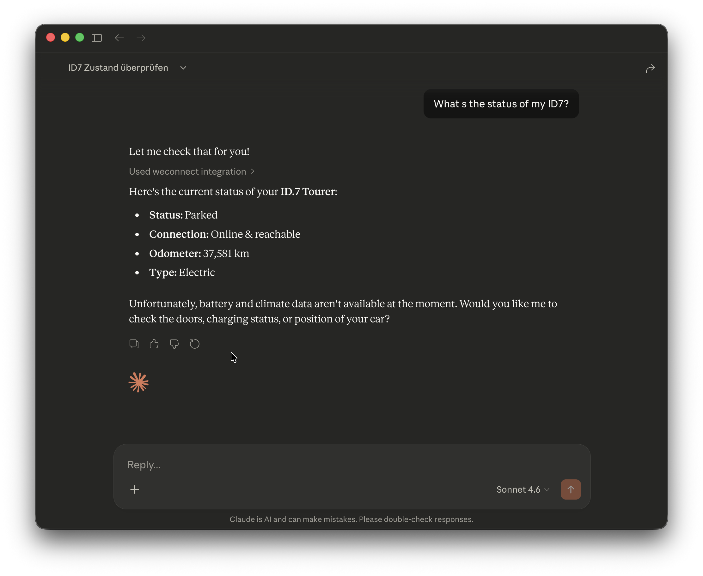
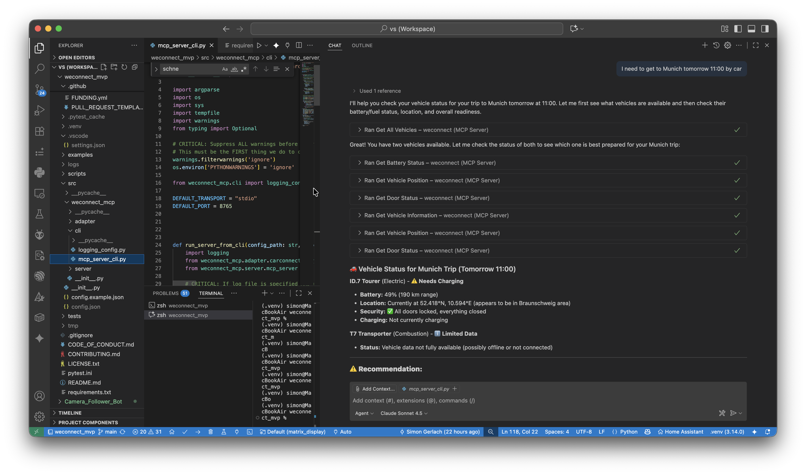
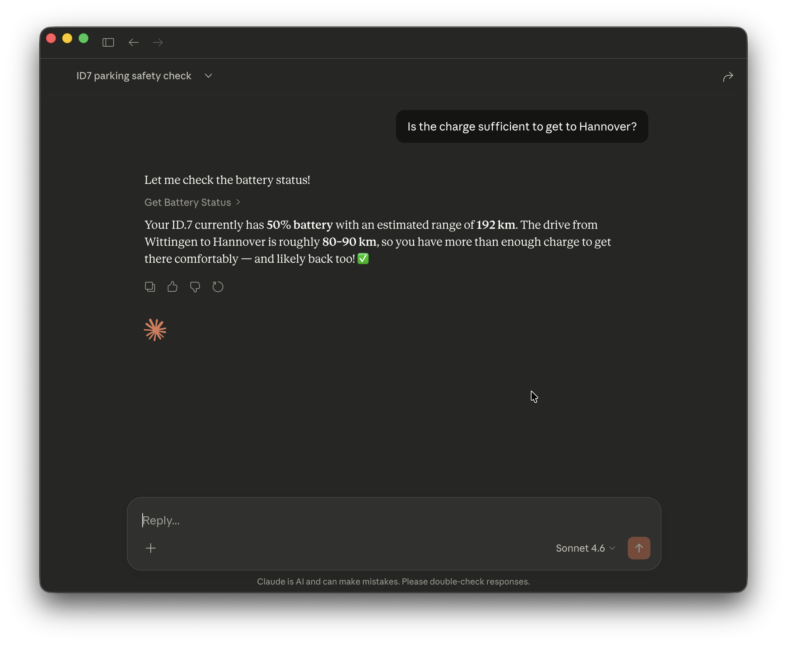

# weconnect_mvp — MCP Server for Connected Vehicles via Tibber

[](https://www.python.org/downloads/)
[](tests/)
[](https://github.com/psf/black)
[](http://creativecommons.org/licenses/by-sa/4.0/)

A developer-focused server that exposes vehicle data via a Model Context Protocol (MCP) interface. Originally built for Volkswagen vehicles — but since moving to the Tibber Data API backend, **it isn't limited to VW**: Tibber's vehicle integration is built on [Enode](https://enode.com), which covers 30+ EV brands (VW Group included), so any vehicle paired to your Tibber account works identically, regardless of make. This project is designed for integration, automation, and experimentation with connected car data.

---

## See It In Action

<p align="center">
  
  
</p>

*Access your vehicle's status through AI assistants like Claude Desktop and GitHub Copilot*

---

## What This Server Can Do

> [!NOTE]
> **Why Tibber, not VW directly?** In May 2026, VW shut down third-party access to its WeConnect
> API (new device-attestation requirements open-source projects can't obtain — see the
> `experiment/vw-attestation-finding` branch for the technical details of that block).
> This project's original direct integration (the `carconnectivity` library) stopped working
> because of that, so the whole server was redesigned around the read-only
> [Tibber Data API](https://data-api.tibber.com/docs/) instead. The old VW-direct code still
> exists, unmaintained, on the permanent
> [`carconnectivity` branch](https://github.com/Smengerl/vw_connect_mcp/tree/carconnectivity).
>
> That redesign is a trade-off: it loses most of what the old integration could do (see below),
> but in exchange it's no longer VW-specific — Tibber's vehicle integration covers 30+ EV brands,
> so this server now works with any vehicle paired to your Tibber account, not just VW.

The Tibber Data API is **read-only** and covers only what Tibber's 5 confirmed vehicle
capabilities expose: identity (VIN, brand, model, name, online state) plus charging/range (state
of charge, target SoC, remaining range, plug status, charging state) for electric vehicles. There
is no door/window/tyre/light/climate/GPS/maintenance data, and no remote commands (lock, climate,
charging control, lights) at all — Tibber's API has no write endpoints whatsoever.

`vehicle_id` resolution (VIN/name/license-plate lookup) and the response shape are the same
regardless of make — the `brand` field just reflects whatever your paired vehicle actually is
(e.g. `"Volkswagen"` for the vehicle this project was built and verified against).

See the full 51-point comparison against the old VW-direct data, the OAuth2/API research behind
this backend, and the current architecture in [`ARCHITECTURE.md`](ARCHITECTURE.md).

### Known Limitations

1. **No license plate data (Tibber API limitation):** The Tibber Data API does not provide license plate information. All vehicles will show `license_plate: null`. This is a limitation of Tibber's API, not this server.
2. **No door/window/tyre/light/climate/GPS/maintenance data:** Tibber's confirmed capabilities cover only identity and charging/range — see above.
3. **Read-only:** No remote commands (lock, climate, charging control, lights) are possible — Tibber's API has no write endpoints at all.
4. **Refresh token rotation:** Tibber rotates the refresh token on every use; the token file must be on writable, persisted storage or re-authentication will eventually be required.

---

## Features

- **MCP Server**: Provides a standard MCP interface for accessing vehicle data
- **Tibber Data API backend** — read-only, via [Tibber](https://data-api.tibber.com/docs/) (an
  official VW integration partner); works despite VW's third-party API block (see
  [What This Server Can Do](#what-this-server-can-do))
- **AI Assistant Ready**: Works with Claude Desktop, VS Code Copilot, ChatGPT, Claude.ai and other MCP-compatible tools
- **Cloud Deployable**: Ships with `Dockerfile`, `docker-compose.yml` and Railway config for one-command cloud deployment
- **API-Key Authentication**: Bearer token auth for secure public HTTP endpoints
- **Flexible CLI**: Multiple transport modes (stdio for local, HTTP for cloud)
- **Configurable**: Credentials via config file or environment variables (for Docker / Railway)

---

## Quick Start

Get up and running in 3 steps:

1. **Install**

   ```bash
   git clone https://github.com/Smengerl/weconnect_mvp.git
   cd weconnect_mvp
   ./scripts/setup.sh
   ```

2. **Configure** — register an OAuth2 client and log in once:

   ```bash
   cp src/tibber_config.example.json src/tibber_config.json
   # edit src/tibber_config.json with your client_id/client_secret
   python -m weconnect_mcp.cli.tibber_login_cli src/tibber_config.json   # one-time interactive login
   ```

   See [Setting Up Tibber Credentials](#setting-up-tibber-credentials) for where to get the client id/secret and other options.

3. **Connect an AI assistant**

   ```bash
   ./scripts/create_claude_config.sh  # Claude Desktop -- copy output to Claude's config
   ```

   Restart Claude Desktop and ask: *"What vehicles are available?"*

   See [Connecting AI Assistants](#connecting-ai-assistants) below for GitHub Copilot, Microsoft
   Copilot Desktop, Cline, or a cloud deployment (ChatGPT, Claude.ai, …).

---

## Getting Started

### Prerequisites

- Python 3.8+
- A Tibber account with a vehicle paired to it (any brand Tibber/Enode supports — not just VW,
  see [What This Server Can Do](#what-this-server-can-do)), and an OAuth2 client registered at
  data-api.tibber.com (see [Setting Up Tibber Credentials](#setting-up-tibber-credentials))
- (Recommended) Virtual environment

### Installation

**Quick Start (Recommended):**

Simply run the setup script which handles everything automatically:

```bash
git clone https://github.com/Smengerl/weconnect_mvp.git
cd weconnect_mvp
./scripts/setup.sh
```

The script will:

- ✅ Detect your Python installation
- ✅ Create a virtual environment at `.venv/`
- ✅ Install the project in editable mode (`pip install -e .`)
- ✅ Create configuration template

**Manual Installation (Alternative):**

```bash
git clone https://github.com/Smengerl/weconnect_mvp.git
cd weconnect_mvp
python -m venv .venv
source .venv/bin/activate  # On Windows: .venv\Scripts\activate
pip install -e .
```

For running tests locally, install test extras:

```bash
pip install -e ".[test]"
```

#### Windows-Specific Notes

⚠️ **Important for Windows Users:**

The setup script automatically detects and avoids Microsoft Store Python (which doesn't work). If you see errors about Python not found:

1. **Install Python from python.org** (not Microsoft Store)
   - Download from [python.org](https://www.python.org)
   - ✅ Check "Add Python to PATH" during installation

2. **Disable Microsoft Store Python alias** (if you have it):
   - Settings → Apps → Advanced app settings → App execution aliases
   - Turn OFF: `python.exe`, `python3.exe`, `python3.x.exe`

3. **Verify your Python installation:**

   ```bash
   # Should return a path like: C:\Program Files\PythonXXX\python.exe
   where python
   ```

### Setting Up Tibber Credentials

1. **Register an OAuth2 client** at <https://data-api.tibber.com/clients/manage/> — see
   [`ARCHITECTURE.md`](ARCHITECTURE.md#21-registering-an-oauth2-client) for the exact scopes to
   select and redirect URI to use.
2. **Provide credentials** — two options, and you can mix them (environment variables override
   the file when both are present):

   **Option A — file** (recommended for Claude Desktop / VS Code Copilot: those launch the server
   with their own environment, not your shell's, so `export`ed variables never reach it):
   ```bash
   cp src/tibber_config.example.json src/tibber_config.json
   # edit src/tibber_config.json with your client_id/client_secret
   ```
   `src/tibber_config.json` is gitignored.

   **Option B — environment variables** (recommended for Docker/Railway):
   ```bash
   export TIBBER_CLIENT_ID="your-client-id"
   export TIBBER_CLIENT_SECRET="your-client-secret"
   export TIBBER_REDIRECT_URI="http://localhost:8515/callback"   # optional, this is the default
   export TIBBER_TOKEN_PATH="./tibber_tokens.json"                # optional, this is the default
   ```
3. **Run the one-time interactive login** (opens a browser; only needs to be done once — the
   server itself never opens a browser, it only refreshes the resulting token non-interactively).
   `tibber_login_cli` takes the same optional credentials-file argument as the server, with
   identical file/env precedence — pass it if you used Option A above:
   ```bash
   python -m weconnect_mcp.cli.tibber_login_cli src/tibber_config.json   # Option A (file)
   python -m weconnect_mcp.cli.tibber_login_cli                          # Option B (env vars)
   ```
   On success this writes the token to `token_path` (from the file, or `TIBBER_TOKEN_PATH`/its
   `./tibber_tokens.json` default) and lists the vehicle(s) found in your Tibber account. You
   won't be asked to log in again — every later run just refreshes this token.
4. **Start the server** — the config file is optional (pass it if you used Option A above):
   ```bash
   python -m weconnect_mcp.cli.mcp_server_cli [src/tibber_config.json]
   ```

`./scripts/create_claude_config.sh`, `./scripts/create_github_copilot_config.sh`, and
`./scripts/create_copilot_desktop_config.sh` (see [Connecting AI Assistants](#connecting-ai-assistants))
already generate configs pointing at `src/tibber_config.json` with a correct `"cwd"` — no manual
editing of the generated MCP client config needed. If you hand-edit an MCP client config instead,
make sure it has a `"cwd"` pointing at this repo: without one, a relative `token_path` resolves
against the *client's* working directory (e.g. Claude Desktop's own), not this project's — a real
failure mode, not a theoretical one. See [`ARCHITECTURE.md`](ARCHITECTURE.md#6-troubleshooting)
for troubleshooting specific error messages (missing credentials, no cached token, `invalid_grant`).

### Running the Server

The server supports two transport modes depending on the AI agent you want to use:

- **stdio**: When running MCP server locally on the same machine as your AI agent (Claude Desktop, VS Code Copilot)
- **http**: For cloud deployment or when the local AI agent requires this mode (e.g. ChatGPT)

#### CLI Options

You can start the MCP server using the provided CLI scripts or directly via Python:

**1. Starting the server in foreground (with logs to console)**

```bash
./scripts/start_server_fg.sh
```

**2. Starting the server in background (with logs to file)**

```bash
./scripts/start_server_bg.sh
```

If started in the background, stop the server using the script:

```bash
./scripts/stop_server_bg.sh
```

Alternatively, kill the process via PID.

**3. Starting the server directly via Python**

```bash
# No config file needed if TIBBER_CLIENT_ID/TIBBER_CLIENT_SECRET are set as env vars:
python -m weconnect_mcp.cli.mcp_server_cli --port 8089

# With a credentials file:
python -m weconnect_mcp.cli.mcp_server_cli src/tibber_config.json --port 8089
```

> `./scripts/start_server_fg.sh` and `./scripts/start_server_bg.sh` both forward extra arguments,
> so e.g. `./scripts/start_server_fg.sh src/tibber_config.json --port 8765` works too.

#### CLI Parameters

The MCP server can be started with several command-line parameters to control its behavior:

| Parameter           | Default                                   | Description                                                      |
|---------------------|-------------------------------------------|------------------------------------------------------------------|
| `config`            | (none)                                    | Path to a Tibber credentials JSON file; optional — env vars alone are sufficient |
| `--log-level`       | `INFO`                                    | Set logging level: `DEBUG`, `INFO`, `WARNING`, `ERROR`, `CRITICAL` |
| `--log-file`        | (stderr only)                             | Path to log file (if not set, logs to stderr only)              |
| `--transport`       | `stdio`                                   | Transport mode: `stdio` (for AI) or `http` (for API)            |
| `--port`            | `8089`                                    | Port for HTTP mode (only relevant with `--transport http`)       |

**Example:**

```bash
python -m weconnect_mcp.cli.mcp_server_cli --log-level DEBUG --log-file server.log --transport http --port 8089
```

---

## Connecting AI Assistants

### Claude Desktop Integration

Generate your configuration for Claude Desktop with the following script and follow the instructions to add it to your Claude Desktop configuration:

```bash
cd /path/to/weconnect_mvp
./scripts/create_claude_config.sh
```

Reload Claude Desktop and ask questions like:

- "What vehicles are available?"
- "Show me my car's battery status"

#### Example Usage

> The screenshots and video below were captured against the old VW-direct (`carconnectivity`)
> backend, before VW blocked third-party access and this project moved to Tibber — kept here for
> illustration. See [MCP Tool & Prompt Reference](#mcp-tool--prompt-reference) below for what
> actually works today: battery status and charging status still work exactly like this; vehicle
> position and starting/stopping a charging session do not (Tibber has no position data at all,
> and no write endpoints).

**Check battery status and state of charge** *(still works today)*:



**Get complete vehicle status** *(today: identity + battery/charging only, no doors/climate/position)*:


**Interactive demo video** *(recorded against the old `carconnectivity` backend)*:


---

### GitHub Copilot (VS Code) Integration

Generate your configuration for GitHub Copilot with the following script and follow the instructions to add it to your VS Code settings:

```bash
cd /path/to/weconnect_mvp
./scripts/create_github_copilot_config.sh
```

Restart VS Code and verify installation by typing `/list` in Copilot Chat. Look for tools starting with `mcp_weconnect_`

#### Example Usage

> Captured against the old `carconnectivity` backend, same caveat as the Claude Desktop
> screenshots above — the doors/location parts of this workflow don't work with Tibber, only
> battery/charging status does.

**Prepare for a trip - check battery, charging status, doors, and location:**


**Interactive demo video** *(recorded against the old `carconnectivity` backend)*:


---

### Microsoft Copilot Desktop Integration (untested)

Generate your configuration for Microsoft Copilot Desktop with the following script:

```bash
cd /path/to/weconnect_mvp
./scripts/create_copilot_desktop_config.sh
```

Copy the configuration file to Microsoft Copilot Desktop's config directory:

```bash
mkdir -p ~/Library/Application\ Support/Microsoft/Copilot
cp tmp/copilot_desktop_mcp.json ~/Library/Application\ Support/Microsoft/Copilot/mcp.json
```

Restart Microsoft Copilot Desktop completely and test

---

### Other AI Tools (Cline)

The server uses the standard MCP protocol and works with all MCP-compatible tools.

**Cline (VS Code Extension)** - Configuration in `.vscode/cline_mcp_settings.json`:

```json
{
  "mcpServers": {
    "weconnect": {
      "command": "python",
      "args": [
        "-m",
        "weconnect_mcp.cli.mcp_server_cli",
        "/path/to/your/config.json"
      ]
    }
  }
}
```

---

### Local HTTP Mode

You can also start the server in HTTP mode locally, for programmatic access or to test the cloud setup before deploying.

> **Port strategy for HTTP mode**
>
> - **Railway / cloud**: Railway injects `$PORT` automatically (default in image: `8080`). No manual configuration needed.
> - **Local Docker**: Container runs internally on `8080`; `docker-compose.yml` maps host port **`8089`** → container port `8080`. Access via `http://localhost:8089`.
> - **Local CLI (no Docker)**: `start_server_http.sh` defaults to port **`8089`**. Use a different port only when that port is already in use.
>
> Using a non-standard port (`8089`) for local Docker/CLI avoids conflicts when multiple MCP servers are running side by side.

**Via script (recommended):**

```bash
# Reads credentials from .env automatically
./scripts/start_server_http.sh          # starts on http://localhost:8089 (default)
./scripts/start_server_http.sh 8090     # override port if needed
```

**Inline (manual override):**

```bash
MCP_API_KEY=your-secret-key \
TIBBER_CLIENT_ID=your-client-id \
TIBBER_CLIENT_SECRET=your-client-secret \
./scripts/start_server_http.sh 8089
```

The server will then be available at `http://localhost:8089`.

- MCP endpoint: `http://localhost:8089/mcp`
- Health check: `http://localhost:8089/health`

**Connecting AI clients (VS Code Copilot, Claude Code) to a local HTTP server:**

```json
// VS Code: %APPDATA%\Code\User\mcp.json
{
  "servers": {
    "weconnect": {
      "type": "http",
      "url": "http://localhost:8089/mcp",
      "headers": { "Authorization": "Bearer <YOUR_MCP_API_KEY>" }
    }
  }
}
```

```json
// Claude Desktop: ~/Library/Application Support/Claude/claude_desktop_config.json
{
  "mcpServers": {
    "weconnect": {
      "url": "http://localhost:8089/mcp",
      "headers": { "Authorization": "Bearer <YOUR_MCP_API_KEY>" }
    }
  }
}
```

---

## MCP Tool & Prompt Reference

This MCP server provides **5 tools** and **11 prompts** that AI assistants can use. There is no
separate MCP Resources layer: it would have been a 1:1 duplicate of the tools with no added
capability for the clients this project targets (Claude Desktop, VS Code Copilot, Claude Code) —
see `src/weconnect_mcp/server/mixins/read_tools.py` for the reasoning. All 5 tools are fully
functional — none of them ever fail due to missing backend data, because everything the Tibber
Data API doesn't provide (doors, windows, tyres, lights, climate, GPS position, maintenance, and
any remote command) simply has no tool at all, rather than a tool that always returns an error.

> **Source of truth:** The canonical, up-to-date reference — including the exact wording each
> tool/prompt reports — lives in
> [`src/weconnect_mcp/server/AI_INSTRUCTIONS.md`](src/weconnect_mcp/server/AI_INSTRUCTIONS.md)
> and in `src/weconnect_mcp/server/mixins/{read_tools,prompts}.py`.

### MCP Tools

| Tool | Description |
|------|---|
| `get_vehicles` | List all vehicles: VIN, name, model (`license_plate` always `null` — Tibber doesn't provide it) |
| `get_vehicle_info` | Manufacturer, model, name, online state (odometer/year/software version always `null`) |
| `get_vehicle_state` | Same as `get_vehicle_info` — no richer combined snapshot exists with this backend |
| `get_battery_status` | Battery level, electric range, charging flag |
| `get_charging_status` | Charging/plug state, target/current SOC (`charging_power_kw`/`remaining_time_minutes` always `null`) |

### What AI Assistants Can Do

✅ List vehicles and identify them by name, VIN, or license plate
✅ Read battery level, range, and charging/plug status
✅ Answer "How much charge does my car have?" / "Is it plugged in?"
❌ Cannot read doors, windows, climate, position, tyres, lights, or maintenance data — not available via Tibber
❌ Cannot execute any remote command (lock, climate, charging control, lights) — the Tibber Data API is read-only, full stop

---

## Cloud Deployment

The server ships with a `Dockerfile` and supports full cloud deployment, enabling connections from web-based AI services such as **ChatGPT**, **Claude.ai**, or any other MCP-compatible client.

### Architecture

In HTTP/cloud mode the server starts two things independently:

1. **HTTP server** starts immediately → cloud health checks pass right away
2. **Tibber connect** (a non-interactive token refresh) runs in the background → `/health` reports
   `"ready": false` until complete, then `"ready": true`

Tools called before the adapter is ready return a friendly `"Server is still starting"` error instead of crashing.

> ⚠️ **Cloud deployment — token bootstrap.** The Tibber OAuth login is a
> one-time *interactive* step (browser + human click) that cannot run inside a headless
> container, and Tibber has no `client_credentials` grant (confirmed live,
> [`ARCHITECTURE.md`](ARCHITECTURE.md#23-no-client_credentials-grant--a-refresh-token-must-persist-across-restarts)) —
> `client_id`/`client_secret` alone can never mint a fresh access token, so a `refresh_token` must
> persist across restarts one way or another. The bridge: run
> `python -m weconnect_mcp.cli.tibber_login_cli` **locally** first, then paste that run's token
> file contents into the `TIBBER_TOKEN_JSON` environment variable. On first boot only, the server
> writes that into the file at `TIBBER_TOKEN_PATH` (Dockerfile default:
> `/tmp/tibber-tokens/tibber_tokens.json`, on the `tibber-tokens` volume in `docker-compose.yml`).
> Every token refresh after that rewrites the file directly (including Tibber's rotating
> `refresh_token`) — as long as `TIBBER_TOKEN_PATH` is on a **persisted volume**, it survives
> future restarts and `TIBBER_TOKEN_JSON` is never read again. Without a volume, each restart
> re-seeds from the same (increasingly stale) env var, which works until that seed's
> `refresh_token` is rotated away — set up a volume for anything beyond quick local testing.

### Option A: Railway (recommended)

[Railway](https://railway.com) is a platform-as-a-service that builds and runs your Docker container automatically. It detects the `Dockerfile` and `railway.toml` in this repo with zero configuration.

**Step 1 – Install Railway CLI and log in**

```bash
brew install railway     # macOS; see https://docs.railway.com/guides/cli for other OSes
railway login
```

**Step 2 – Create project and deploy**

```bash
cd /path/to/weconnect_mvp
railway init             # creates a new Railway project linked to this directory
railway up --detach      # builds the Docker image and deploys it
```

**Step 3 – Set secret environment variables**  
Never put credentials in the repository. Set them in the Railway dashboard instead (see the token
bootstrap caveat above before deploying):

```bash
railway variables set TIBBER_CLIENT_ID="your-client-id"
railway variables set TIBBER_CLIENT_SECRET="your-client-secret"
railway variables set MCP_API_KEY="$(python3 -c 'import secrets; print(secrets.token_urlsafe(32))')"

# First deploy only -- paste in the contents of the token file produced by
# running `python -m weconnect_mcp.cli.tibber_login_cli` locally:
railway variables set TIBBER_TOKEN_JSON="$(cat tibber_tokens.json)"
```

Then, in the Railway dashboard, add a **Volume** to the service mounted at
`/tmp/tibber-tokens` (Service → Settings → Volumes) so the token the server writes there survives
redeploys — without it, every redeploy re-seeds from the (increasingly stale) `TIBBER_TOKEN_JSON`
above, which stops working once Tibber rotates that seed's `refresh_token` away.

Or go to: **railway.com → your project → service → Variables**

**Step 4 – Get the public URL**

```bash
railway domain           # e.g. https://weconnectmcp-production.up.railway.app
```

**Step 5 – Verify**

```bash
curl https://<your-subdomain>.up.railway.app/health
# → {"status": "ok", "ready": true, "service": "weconnect-mcp"}
```

Every `git push` followed by `railway up` redeploys the service.

---

### Option B: Docker (local or any host)

**Local test with Docker Compose:**

```bash
cp .env.example .env   # fill in your real credentials

# First run only: seed the token (see the caveat above).
# tibber_login_cli doesn't load .env itself, so export it into the shell first:
set -a && source .env && set +a
python -m weconnect_mcp.cli.tibber_login_cli
echo "TIBBER_TOKEN_JSON=$(cat tibber_tokens.json)" >> .env

docker compose up --build
```

The server is then available at `http://localhost:8089`. The `tibber-tokens` volume in
`docker-compose.yml` persists the refreshed token across `docker compose restart`/rebuilds, so the
`tibber_login_cli` step above is only needed once, the very first time.

---

### Environment Variables (Cloud / Docker)

Credentials and the API key are passed via environment variables — **never put them in the repository**:

| Variable | Required | Description |
|---|---|---|
| `TIBBER_CLIENT_ID` | Yes (or via file) | OAuth2 client id from data-api.tibber.com |
| `TIBBER_CLIENT_SECRET` | Yes (or via file) | OAuth2 client secret |
| `TIBBER_REDIRECT_URI` | Optional | Default: `http://localhost:8515/callback` |
| `TIBBER_TOKEN_PATH` | Optional | Image default: `/tmp/tibber-tokens/tibber_tokens.json` (mount a volume here — see the caveat above) |
| `TIBBER_TOKEN_JSON` | First boot only | Contents of a token file produced locally by `tibber_login_cli` — bootstraps `TIBBER_TOKEN_PATH` once, see the caveat above |
| `MCP_API_KEY` | Yes | Bearer token clients must send for authentication |
| `PORT` | Auto | HTTP port (Railway injects this automatically; default: `8080`) |
| `CORS_ORIGINS` | Optional | Comma-separated allowed origins (default: `*`) |

Generate a strong API key:

```bash
python3 -c "import secrets; print(secrets.token_urlsafe(32))"
```

---

### Connecting AI Clients to the Cloud Server

Once deployed, point any MCP-compatible client at your public URL:

- **MCP endpoint:** `https://<your-host>/mcp`
- **Authentication:** HTTP header `Authorization: Bearer <MCP_API_KEY>`

**Claude.ai:**  
Settings → Integrations → Add MCP Server → enter URL and header

**ChatGPT Custom GPT:**  
Configure → Actions → select MCP → enter URL and `Authorization: Bearer <key>`

**GitHub Copilot (VS Code) via remote server:**  
Add to `.vscode/mcp.json`:

```json
{
  "servers": {
    "weconnect-cloud": {
      "type": "http",
      "url": "https://<your-host>/mcp",
      "headers": {
        "Authorization": "Bearer <MCP_API_KEY>"
      }
    }
  }
}
```

---

### Security

⚠️ **Always set `MCP_API_KEY`** – without it the server runs unauthenticated (locally or in the cloud)  
⚠️ **Never commit `.env` or `src/tibber_config.json`** – both are gitignored  
⚠️ **The Tibber token file** (`tibber_tokens.json` or wherever `TIBBER_TOKEN_PATH` points) contains session tokens – keep it secure  
⚠️ **Rotate `MCP_API_KEY`** immediately if it was ever accidentally exposed (e.g. pasted into a chat)  
⚠️ The `/health` endpoint is intentionally unauthenticated (required for Railway / Docker health checks)

---

## Testing

Run the test suite with:

```bash
./scripts/test.sh

# Run with verbose output
./scripts/test.sh -v

# Show help
./scripts/test.sh --help
```

**Test Structure:**

- **36 tests** - Run in ~0.1 seconds, no Tibber account needed (uses a mock adapter)
- No slow/real-API tests exist today — the Tibber Data API is read-only, so there's nothing beyond
  what the mock adapter already covers

For detailed test documentation, see [tests/README.md](tests/README.md)

---

## Contributing

Contributions are welcome! Please see `CONTRIBUTING.md` and follow the code of conduct.

---

## Additional Documentation

- **[ARCHITECTURE.md](ARCHITECTURE.md)** - Full Tibber Data API research, the 51-point data comparison against the old VW-direct (`carconnectivity`) backend, current adapter architecture, and project history
- The technical details of VW's third-party API block (device-attestation requirements, tested live) live on the standalone [`experiment/vw-attestation-finding`](https://github.com/Smengerl/vw_connect_mcp/tree/experiment/vw-attestation-finding) branch, never merged into `main`
- **[scripts/README.md](scripts/README.md)** - All available scripts and how to use them
- **[scripts/lib/README.md](scripts/lib/README.md)** - Python detection library documentation
- **[tests/README.md](tests/README.md)** - Test suite overview
- **[CONTRIBUTING.md](CONTRIBUTING.md)** - Contribution guidelines

---

## License

This project is licensed under the Creative Commons Attribution-ShareAlike 4.0 International License (CC BY-SA 4.0) — see `LICENSE.txt` for details or visit <http://creativecommons.org/licenses/by-sa/4.0/>

---

## Credits

This project was originally built on top of the excellent **[CarConnectivity](https://github.com/tillsteinbach/CarConnectivity)** library by [Till Steinbach](https://github.com/tillsteinbach), which provided direct VW WeConnect API access before VW blocked third-party clients. That integration lives on, unmaintained, on the permanent [`carconnectivity` branch](https://github.com/Smengerl/vw_connect_mcp/tree/carconnectivity).

---

## Additional Resources

- [MCP Specification](https://spec.modelcontextprotocol.io/)
- [FastMCP Documentation](https://github.com/jlowin/fastmcp)
